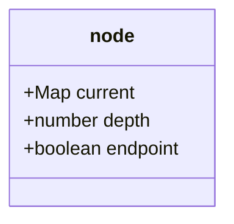
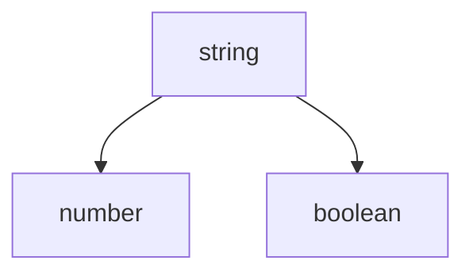

# GLOBAL REGISTRY FOR FUNCTION VARIANTS IN FUNCTION OVERLOADING

## Asbtract

Function overloading is a feature that allows a funtion to have multiple definitions with the same name but different parameters. When invoking a function by calling the syntax e.g "func()", the compiler (or interpreter)
will checks for the name of called function, after that it will cheks for the function signature (function paramters). If the two operations return, a function object will be retrieved and the execution occurs.

## Acknowledgment


## Consideration

Reflectype rebuilds and provides robust the function overloading mechanism that meet the two concepts that are mostly implemented by OOP languages (such as C++, Java, C#) are Single Dispatch and Multiple Dispatch.

The idea for cosntructing a function overloading system is that there is a tree (exactly trie datastructure) that store all the declared function signature (parameter types of function). When a function call occurs, a lookup operation is performed on the trie to find the function object that mathes the signature retrieved from the passed arguments.

Trie data structure generated for the method overloading not only serves the purpose of storing the metadata about classes's methods but also for the function oveloading (function that are not owned by ant classes). There would be conflicts betwwen class and non-class functions because of the same name and signature whose functions hold. There possible scenarios that could occur:

1. A class method invoked by calling `SomeClassObject.method()`
2. A non-class function invoked without binding to any objects `foo()`
3. A non-class function invoked with a binder eg. `foo.call(binder, ...args)` or `foo.apply(binder, args)`.

As we can see, looking up a `function_metadata_t` object for either functions or methods by diving into the signature trie is not a feasible approach because of the polymorphical structure of classes would lead to a lot of ambiguity and inexact selection of method variant for class methods. In this case, a vTable (virtual table) take it place but for the solution of non-class functions the vTable would conficts with scenarios #3. Therefore, a general approach is needed to solve this problem. Instead of looking up the function's metadata which is stored in everything trie endpoints, the target of interest will now be a row of the global registry that holds all the information about function variants. After retrieving the registry row and base on the resolution of the funciton object (class method or non-class function) the corresponding function variant will be selected.

In this approach, the Global Registry would holds:
- Scope (either namespace) of the registered functions (including methods).
- Class vTables of registered classes.


Consider the following function declarations illustated in TypeScript:

```ts
function foo(a: string, b: number);
function foo(a: string);
function foo(a: string,  b: boolean);
```

A single trie node structure:




The function signature trie would be constructed as follow:



```mermaid

```
